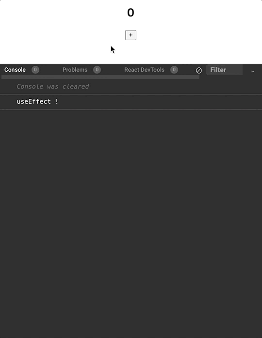

# #6.4 Cleanup

## 1. Cleanup함수

: `useEffect()`에서 첫번째 argument로 넣은 함수의 **return 함수**이다.

### 컴포넌트가 사라질때(unmount 시점), 특정 값이 변경되기 직전(deps update 직전)에 실행할 작업을 지정할 수 있다.

```javascript
useEffect(() => {
  // mount 시점, deps update 시점에 실행할 작업 (componentDidMount)
  return () => {
    // unmount 시점, deps update 직전에 실행할 작업 (componentWillUnmount)
  };
}, [deps]);
```

### Cleanup함수 사용시 작동 순서

> re-render ➡ 이전 effect clean-up ➡ effect

### 예제1

```javascript
import React, { useState, useEffect } from "react";

export default function App() {
  const [count, setCount] = useState(0);

  useEffect(() => {
    console.log("useEffect !");
    return () => {
      console.log(count);
    };
  }, [count]);

  return (
    <div className="App">
      <h2>{count}</h2>
      <button onClick={() => setCount(count + 1)}>+</button>
    </div>
  );
}
```

- `Cleanup함수`는 **이전의 값**을 바라보고 있기 때문에 해당 코드는 아래 와 같이 작동


