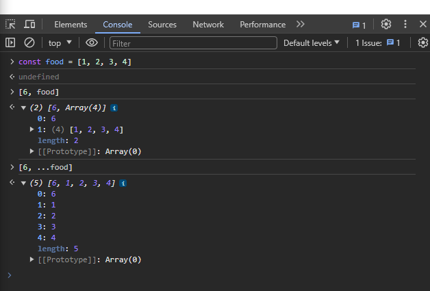

# #7.0 ~ #7.1 To Do List

## 1. input생성하고 form 제어하기

- 글자 입력할 수 있는 input과 button 생성
- input값을 어떻게 컨트롤할 수 있을까?

  - `useState()`를 통해 기본값을 빈 String으로 설정
  - value을 받기위해 toDo와 수정함수 setToDo 기입

  ```javascript
  const [toDo, setToDo] = useState("");
  ```

- input에 value로 toDo를 부여하고 onChange이벤트 부여하기

```javascript
const { useState } = require("react");
function App() {
  const [toDo, setToDo] = useState("");
  const onChange = (event) => setToDo(event.target.value);
  return (
    <div>
      <form>
        <input
          onChange={onChange}
          value={toDo}
          type="text"
          placeholder="Write your to do..."
        />
        <button>Add To Do</button>
      </form>
    </div>
  );
}
export default App;
```

- form은 submit 이벤트를 갖고 있다.  
  그러므로 event.preventDefault(); 를 이용하여 기본동작(새로고침)을 막는다.
- input이 비어있는 상태로 submit되는 경우 막기
- submit하면서 input값 비워주기
  - state는 직접적으로 수정 불가능 (예: toDo = ""; ) ❌
  - 수정하는 함수를 사용해 수정해야한다. (예 : setToDo = (""); ) ⭕

```javascript
const { useState } = require("react");
function App() {
  const [toDo, setToDo] = useState("");
  const onChange = (event) => setToDo(event.target.value);
  const onSubmit = (event) => {
    event.preventDefault();
    if (toDo === "") {
      return;
    }
    setToDo("");
  };
  return (
    <div>
      <form onSubmit={onSubmit}>
        <input
          onChange={onChange}
          value={toDo}
          type="text"
          placeholder="Write your to do..."
        />
        <button>Add To Do</button>
      </form>
    </div>
  );
}
export default App;
```

## 2. 여러개의 toDo를 받을 수 있는 배열 만들기

- 기본값은 비어있는 배열 State 만들기

```javascript
const [toDos, setToDos] = useState([]);
```

- 생성한 배열에 element 추가하는 방법(일반 자바스크립트 => toDos.push)

  - `setToDos()`에 함수를 통해 직전의 값 받기

  ```javascript
  // 1. 화살표함수
  setToDos((currentArray) => {});
  // 2. 일반함수
  setToDos(function (currentArray) {
    return;
  });

  // 두가지 모두 같은 의미이다.
  ```

  - 새로운 배열 return 하기(State는 항상 새로운 거여야 함)

  ```javascript
  setToDos((currentArray) => []);
  ```

  - 새로운 배열은 State에 있는 toDo와 모든 이전의 toDos(...currentArray)를 갖는다.
    
    - `...`을 써서 `currentArray`배열에 `toDo`를 추가 시켜준다.
    - 어플리케이션이 시작될 때는 `비어있는 배열`을 가진다.  
      이유❓ 기본값을 비어있는 배열로 선언했기때문에
      ```javascript
      const [toDos, setToDos] = useState([]);
      ```
    - 첫번째 `toDo로 "Hello"를 입력`할때 `비어있는 배열`을 받아온다.  
      (새로운 `toDos`가 `input을 통해 작성한 toDo`와 아무것도 들어있지 않은 `빈 배열의 element`가 더해지게 된다.)
      ```javascript
      setToDos(([]) => ["Hello", ...[]]);
      // 새로입력한 toDo와 []이 합쳐져 결국엔
      setToDos(([]) => ["Hello"]);
      ```
    - 두번째 `toDo로 "bye bye"를 입력`할때 `"Hello"를 가진 배열`을 받아온다.
      ```javascript
      setToDos((["Hello"]) => ["bye bye", ...["Hello"]]);
      // 새로입력한 toDo와 기존 배열과 합쳐져 결국엔
      setToDos((["Hello"]) => ["bye bye", "Hello"]);
      ```
    - 세번째 `toDo로 "Good"을 입력`할때 `"Hello"와 "bye bye"를 가진 배열`을 받아온다.
      ```javascript
      setToDos((["bye bye", "Hello"]) => ["Good", ...["bye bye", "Hello"]]);
      // 새로입력한 toDo와 기존 배열과 합쳐져 결국엔
      setToDos((["bye bye", "Hello"]) => ["Good", "bye bye", "Hello"]);
      ```
      ❗❗ 이런식으로 계속 To Do List가 증가된다.

```javascript
const { useState } = require("react");
function App() {
  const [toDo, setToDo] = useState("");
  const onChange = (event) => setToDo(event.target.value);
  const onSubmit = (event) => {
    event.preventDefault();
    if (toDo === "") {
      return;
    }
    setToDos((currentArray) => [toDo, ...currentArray]);
    setToDo("");
  };
  return (
    <div>
      <form onSubmit={onSubmit}>
        <input
          onChange={onChange}
          value={toDo}
          type="text"
          placeholder="Write your to do..."
        />
        <button>Add To Do</button>
      </form>
    </div>
  );
}
export default App;
```
