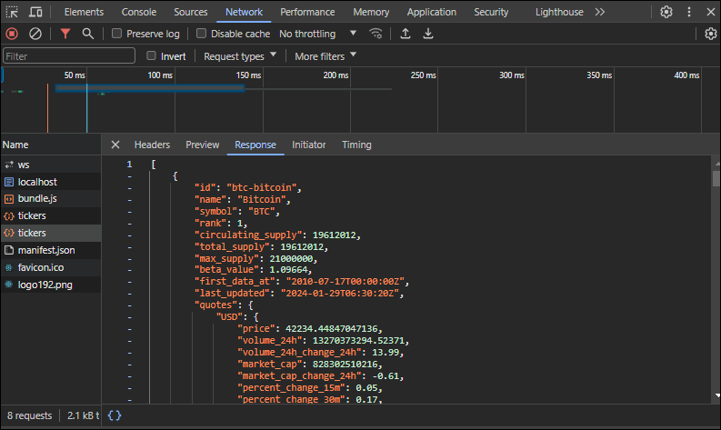

# #7.2 Coin Tracker

암호화폐와 가격 나열하기
: 페이지나 앱을 들어왔을 때 로딩 메세지가 보이고 코인들이 나열되면 로딩 메세지를 숨기고 코인들을 리스트로 보여주기

## 1. 2개의 state 만들기

- 로딩을 위한 state

  ```javascript
  const [loading, setLoading] = useState(true);
  ```

  - 기본값 true
  - 화면단에는 `loading` 이 `true`인 경우 "Loading..." 메세지 출력, `false`인 경우 아무것도 보여주지않음(null)
    🔹 `false`인 경우 아무것도 보여주지않음(null) -> select박스 보여주는 것으로 변경함

- 코인 리스트(API data)를 잠시 갖고 있기 위한 state

  ```javascript
  const [coins, setCoins] = useState([]);
  ```

  - 기본값 [] (빈 배열)
  - 기본값으로 빈 배열을 주지 않으면 추후 length(길이) 출력 못함
    undefined는 length(길이)를 가지고 있지 않기때문이다.

## 2. API 가져오기

> API
> https://api.coinpaprika.com/v1/tickers

- 컴포넌트가 가장 처음으로 render되었을때 이 함수를 즉시 실행시키고 싶음

  - useEffect() 활용  
    이 Effect는 한번만 사용하고 싶기때문에 어떤것에도 의존하지 않고 비워둘 거임(빈 배열)

    ```javascript
    useEffect(() => {}, []);
    ```

- `fetch()`를 사용하여 API 요청(request)하기

  - fetch() : 데이터를 요청하는 함수
    [참고문서] <https://blog.naver.com/loveyou_a_a/222828107745>

  ```javascript
  useEffect(() => {
    fetch("https://api.coinpaprika.com/v1/tickers");
  }, []);
  ```

  > 🚨 요청해서 응답받은 json 데이터 확인하는법
  > 개발자도구(F12) > Network > 해당API json(tickers) > Response

  

- 요청(request)해서 응답(response) 받은 json 추출

  - 첫번째 then()을 사용하여 response를 받아 response.json()을 return
  - 두번째 then()을 써서 변환한 json을 콘솔에 출력

  ```javascript
  useEffect(() => {
    fetch("https://api.coinpaprika.com/v1/tickers")
      .then((response) => reponse.json())
      .then((json) => console.log(json));
  }, []);
  ```

  

## 3. 추출한 data를 컴포넌트에 출력하기

- data확인을 위해 콘솔에 출력한 json data를 coins에 넣기

```javascript
useEffect(() => {
  fetch("https://api.coinpaprika.com/v1/tickers")
    .then((response) => reponse.json())
    .then((json) => {
      // console.log(json);
      setCoins(json);
    });
}, []);
```

- coins 얻기를 끝냈다면 loading을 false로 변경해야됨  
  = API를 통해 coins 데이터 얻기를 완료하면 로딩 메세지는 사라져야됨

```javascript
useEffect(() => {
  fetch("https://api.coinpaprika.com/v1/tickers")
    .then((response) => reponse.json())
    .then((json) => {
      // console.log(json);
      setCoins(json);
      setLoading(false);
    });
}, []);
```

- `map()`을 이용하여 코인 리스트(coins)의 name, symbol, price 화면단에 출력하기
  - map()의 첫번째 argument인 value를 통해 값을 받아오기
  - map()의 두번째 argument인 index를 통해 고유한 key를 줘야되지만 지금은 필요없다.  
    이유❓ API json data 자체에 있는 id를 key로 써도 되기때문이다.
