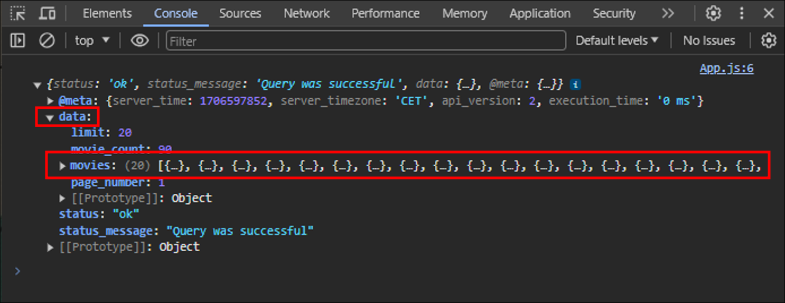

# #7.3 Movie App

영화 소개하기  
: 평점 8.5이상, 연도별로 영화 정보를 제공하고 더 많은 것을 찾아볼 수 있도록 앱에서 다른 곳으로 연결시켜주기  
 (앱 안에서 페이지를 전환하는 방법)

## 1. state 만들기

- 로딩을 위한 state

  ```javascript
  const [loading, setLoading] = useStatee(true);

  return <div>{loading ? <h1>Loading...</h1> : null}</div>;
  ```

  - 기본값 true
  - 화면단에는 `loading`이 `true`인 경우 "Loading..." 문구 출력
  - `false`인 경우 1차적으로는 null 로 설정

- 영화 리스트(API data)를 잠시 갖고 있기 위한 state

  ```javascript
  const [movies, setMovies] = useState([]);
  ```

  - 기본값 [ ] (빈 배열)

## 2. API 가져오기

> API  
> https://yts.mx/api/v2/list_movies.json?minimum_rating=8.8&sort_by=year

- 컴포넌트가 가장 처음으로 render되었을때 어떠한 코드를 딱 한번 실행시키고 싶음

  - `useEffect()` 활용

    ```javascript
    useEffect(() => {}, []);
    ```

  - `fetch()`를 사용하여 API 요청

    ```javascript
    useEffect(() => {
      fetch(
        `https://yts.mx/api/v2/list_movies.json?minimum_rating=8.8&sort_by=year`
      );
    }, []);
    ```

  - 요청해서 응답 받은 json 추출

    - `첫번째 then()`을 사용하여 res를 받아 res.json()을 return
    - `두번째 then()`을 써서 변환한 json을 콘솔에 출력(json data 구조 확인용)

    ```javascript
    useEffect(() => {
      fetch(
        `https://yts.mx/api/v2/list_movies.json?minimum_rating=8.8&sort_by=year`
      )
        .then((res) => res.json())
        .then((json) => console.log(json));
    }, []);
    ```

    

> **async / await**  
> : then() 문법에 의해 생기는 '콜백지옥'을 극복하기 위해 만들어진 문법
> `async`는 함수 이름의 제일 앞에, `await`는 결과를 기다릴 함수 앞에 작성한다.
>
> - `async`는 함수에서 비동기 처리를 위한 promise 동작을 한다는 것을 명시한다.
> - `await`는 호출되는 함수가 적절한 결과를 변환할 때까지 기다리도록 동작한다.

- `async`와 `await` 사용1

```javascript
const getMovies = async () => {
  const res = await fetch(
    `https://yts.mx/api/v2/list_movies.json?minimum_rating=8.8&sort_by=year`
  );
  const json = await res.json();
  console.log(json);
};
useEffect(() => {
  getMovies();
}, []);
```

- `async`와 `await` 사용2(더 간결한 버전)

```javascript
const getMovies = async () => {
  const json = await (
    await fetch(
      `https://yts.mx/api/v2/list_movies.json?minimum_rating=8.8&sort_by=year`
    )
  ).json();
  console.log(json);
};
useEffect(() => {
  getMovies();
}, []);
```

## 3. 추출한 data를 컴포넌트에 출력하기

- data구조 확익을 위해 콘솔에 출력한 json data를 movies에 넣기

```javascript
useEffect(() => {
  fetch(
    `https://yts.mx/api/v2/list_movies.json?minimum_rating=8.8&sort_by=year`
  )
    .then((res) => res.json())
    .then((json) => {
      // console.log(json);
      setMovies(json.data.movies);
    });
}, []);
```

- movies 얻기를 끝냈다면 loading을 false로 변경해야됨

```javascript
useEffect(() => {
  fetch(
    `https://yts.mx/api/v2/list_movies.json?minimum_rating=8.8&sort_by=year`
  )
    .then((res) => res.json())
    .then((json) => {
      // console.log(json);
      setMovies(json.data.movies);
      setLoading(false);
    });
}, []);
```

- `map()`을 이용하여 영화 리스트(movies)의 커버이미지, 제목, 설명, 장르 화면단에 출력하기
  - map() 사용시 key 값은 반드시 있어야한다.

```javascript
return (
  <div>
    {loading ? (
      <h1>Loading...</h1>
    ) : (
      <div>
        {movies.map((movie) => (
          <div key={movie.id}>
            
            <h2>{movie.title}</h2>
            <p>{movie.summary}</p>
            <ul>
              {movie.genres.map((g) => (
                <li key={g}>{g}</li>
              ))}
            </ul>
          </div>
        ))}
      </div>
    )}
  </div>
);
```
