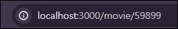
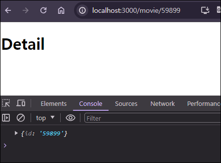
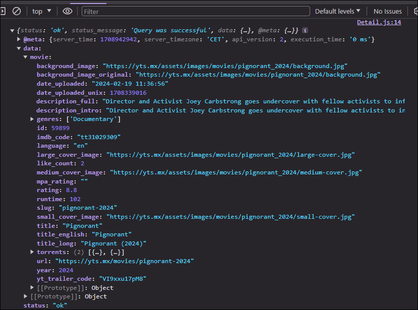
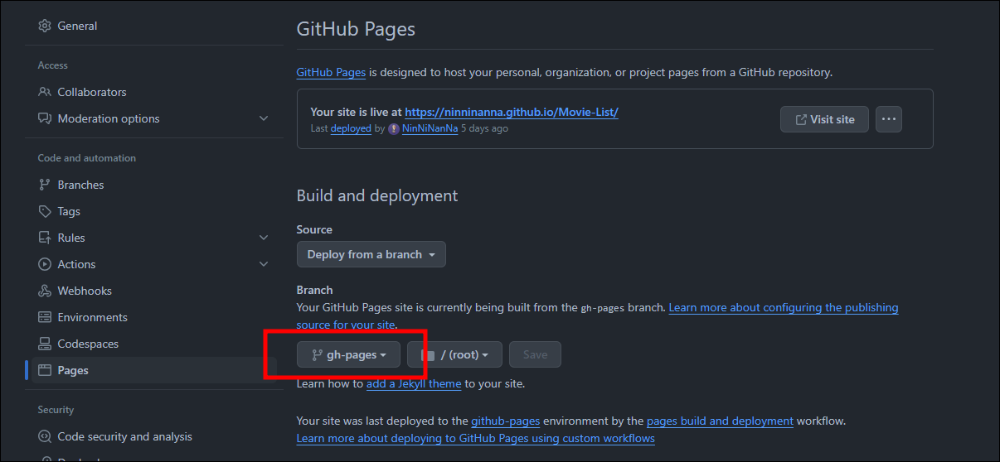

# #7.5 React Router

React.js 앱에서 페이지를 전환하는 방법

## 1. React Router 초기 설정

> ### React Router : 페이지 전환
>
> ### react-router-dom 설치
>
> `npm install react-router-dom`  
> 이번 프로젝트는 5버전으로 설치함  
> `npm i react-router-dom@5.3.0`  
> &nbsp;

### React Router 사용을 위해 폴더 나누기

- src 폴더에 routes와 components 라는 폴더 생성

  - routes 폴더 : 전환되는 화면하나를 그려주는 파일들
    - Home route 생성 (Home.js)
    - Detail route 생성 (Detail.js)
  - components 폴더 : 화면에 포함되는 작은 부분들
    - Movie.js 이동 (App.js에서 Movie 컴포넌트 import 주소 변경)

- Home route는 App 컴포넌트 전체를 가지고 있게 될것임  
  => 이전 App 컴포넌트 코드가 Home 컴포넌트로 옮김 (이때 import 주소 변경!)

- App.js 는 새로운 컴포넌트(router: URL을 보고있는 컴포넌트)를 render한다.  
  => URL에 따라서 Home을 보여주거나 Detail을 보여준다.

## 2. React Router 사용

> #### 두 가지 종류의 라우터
>
> 1. Hash Router
> 2. Browser Router
>
> 차이점은 Hash Router는 # 뒤에 path가 붙는다. (ex http://localhost:3000/#/movie)  
> 대부분은 Browser Router를 사용한다.  
> [ REACT - ROUTER (5버전) ](https://v5.reactrouter.com/web/guides/quick-start)  
> &nbsp;

### `App.js`

```javascript
import { BrowserRouter as Router, Switch, Route } from "react-router-dom";
import Detail from "./routes/Detail";
import Home from "./routes/Home";

function App() {
  return (
    <Router>
      <Switch>
        <Route path="/movie">
          <Detail />
        </Route>
        <Route path="/">
          <Home />
        </Route>
      </Switch>
    </Router>
  );
}

export default App;
```

- `Switch`
  - Route를 찾을때 사용 ( Route를 찾은 후 컴포넌트를 렌더링한다. )
  - 한번에 하나의 Route만 렌더링하기 위해 사용
- 2개의 `Route`를 만들기
  1. 사용자가 홈화면으로 갈때 사용할 Route
  2. 사용자가 `/movie` 으로 갈때 사용할 Route

## 3. 한 Route에서 다른 Route로 이동하는 방법

유저가 영화 제목을 클릭하면 Detail 화면으로 이동  
영화제목 태그에 `<a href="/movie></a>` 태그를 이용하는 방법은 화면 전체가 재실행되기 때문에 적절하지 않다.

### `Movie.js`

```javascript
import PropType from "prop-types";
import { Link } from "react-router-dom";

function Movie({ coverImg, title, summary, genres }) {
  return (
    <div>
      
      <h2>
        <Link to="/movie">{title}</Link>
      </h2>
      <p>{summary}</p>
      <ul>
        {genres.map((g) => (
          <li key={g}>{g}</li>
        ))}
      </ul>
    </div>
  );
}

Movie.propType = {
  coverImg: PropType.string.isRequired,
  title: PropType.string.isRequired,
  summary: PropType.string.isRequired,
  genres: PropType.arrayOf(PropType.string).isRequired,
};

export default Movie;
```

- `Link`  
  : 브라우저 새로고침 없이도 유저를 다른 페이지로 이동시켜주는 컴포넌트

## 4. 동적 URL

React Router는 동적 URL을 지원한다.  
동적 URL이란? url에 변수를 넣을 수 있다는 의미

### `App.js`

```javascript
<Route path="/movie/:id">
  <Detail />
</Route>
```

- url에 변수를 쓰기위해 `:` 가 필요하다.

### `Home.js`

```javascript
<div>
  {movies.map((movie) => (
    <Movie
      key={movie.id}
      id={movie.id}
      coverImg={movie.medium_cover_image}
      title={movie.title}
      summary={movie.summary}
      genres={movie.genres}
    />
  ))}
</div>
```

- Movie.js가 prop으로 id를 받기위해 Home.js에서 `id={movie.id}` 작성

### `Movie.js`

```javascript
function Movie({ id, coverImg, title, summary, genres }) {
  return (
    <div>
      
      <h2>
        <Link to={`/movie/${id}`}>{title}</Link>
      </h2>
      <p>{summary}</p>
      <ul>
        {genres.map((g) => (
          <li key={g}>{g}</li>
        ))}
      </ul>
    </div>
  );
}
```

- prop으로 id를 받아서 영화제목 클릭시 해당 id값 url에 출력

  

## 5. useParams 함수

- React Router에서 제공하는 함수
- url에 있는 변수 값을 반환해주는 함수

### URL에서 id값 반환하기

### `Detail.js`

```javascript
import { useParams } from "react-router-dom";

function Detail() {
  const x = useParams();
  console.log(x);
  return <h1>Detail</h1>;
}

export default Detail;
```

  

### 반환한 id값으로 API에 요청

> ### API
>
> https://yts.mx/api/v2/movie_details.json?movie_id=  
> &nbsp;

`Detail.js`

```javascript
import { useEffect } from "react";
import { useParams } from "react-router-dom";

function Detail() {
  const { id } = useParams();
  const getMovie = async () => {
    const json = await (
      await fetch(`https://yts.mx/api/v2/movie_details.json?movie_id=${id}`)
    ).json();
    console.log(json);
  };
  useEffect(() => {
    getMovie();
  }, []);
  return <h1>Detail</h1>;
}

export default Detail;
```



### [영화 상세정보 추가해서 사이트 마무리 지어보기!!!](https://github.com/NinNiNanNa/Movie-List)

## 6. GitHub Pages 배포

### 1. React 프로젝트 배포하기 전에 해야할 것

1. 배포하고자 하는 프로젝트 repository가 public으로 되어 있는지 확인
2. package.json 파일에 다음을 추가

   ```json
   "homepage": "https://GitHub 계정이름.github.io/저장소 이름",
   ```

3. 프로젝트에서 React Router를 사용하고 있다면 추가적으로 해야하는 과정

   - `BrowserRouter`를 사용하고 있는 파일에서 다음과 같이 basename 속성을 추가

   ```javascript
   // index.js

   // PUBLIC_URL 은 package.json에서 설정한 homepage URL이 적용
   <BrowserRouter basename={process.env.PUBLIC_URL}>
     <App />
   </BrowserRouter>
   ```

### 2. React 프로젝트 build

> #### gh-pages 패키지
>
> [ 공식문서 - gh-pages ](https://create-react-app.dev/docs/deployment/#github-pages)  
> &nbsp;

1. gh-pages 패키지 설치

   ```
   npm i gh-pages
   ```

2. package.json 파일의 `scripts` 안에 다음 내용을 추가

   ```json
   "predeploy": "npm run build",
   "deploy": "gh-pages -d build",
   ```

3. 다음 명령어를 통해 build 과정과 배포 과정을 한번에 하기
   - 프로젝트를 수정하고 다시 배포할때도 다음 명령어 입력
   ```
   npm run deploy
   ```

### 3. 배포 확인

- Settings > Pages로 들어가서 Branch가 gh-pages로 되어 있는지 확인
- 배포에 몇 분정도 시간이 걸리기 때문에 조금 기다렸다가 사이트 주소로 들어가서 확인

  
